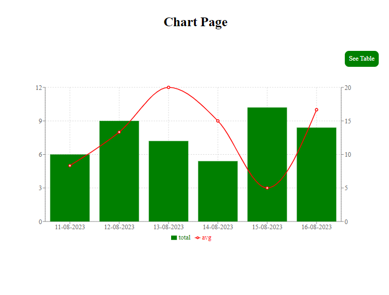
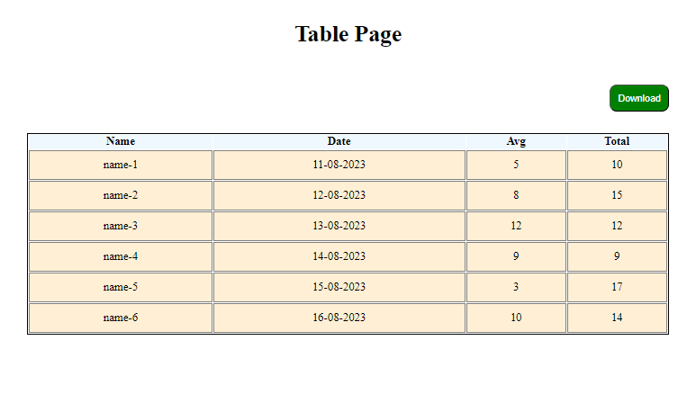

````markdown
# React Web Application with Charts and Tables

This is a two-page web application built using React.js, featuring a chart page and a table page. The chart page displays data using Recharts library to visualize trends over time, while the table page presents tabular data with the ability to download as an Excel file.

## Screenshots

### Chart Page



The chart page displays a composed chart with line and bar charts, showcasing trends over time using the provided data.

### Table Page



The table page presents tabular data with columns for Name, Date, Average, and Total, allowing users to download the data as an Excel file.

## Getting Started

To get started with this project on your local machine, follow these steps:

1. Clone this repository to your local machine:
   ```bash
   git clone https://github.com/your-username/your-project.git
   ```
````

2. Navigate to the project directory:

   ```bash
   cd your-project
   ```

3. Install dependencies:

   ```bash
   npm install
   ```

4. Start the development server:

   ```bash
   npm start
   ```

5. Open your web browser and navigate to http://localhost:3000 to view the application.

## Usage

Once the application is running, you can navigate between the chart page and the table page using the provided links. Interact with the charts and tables to explore the data. On the table page, you can download the data as an Excel file by clicking the "Download" button.

## Technologies Used

- React.js
- React Router
- Redux
- Recharts
- React Table
- XLSX

## Contributing

Contributions are welcome! If you find any issues or have suggestions for improvements, please open an issue or submit a pull request.

```

```
